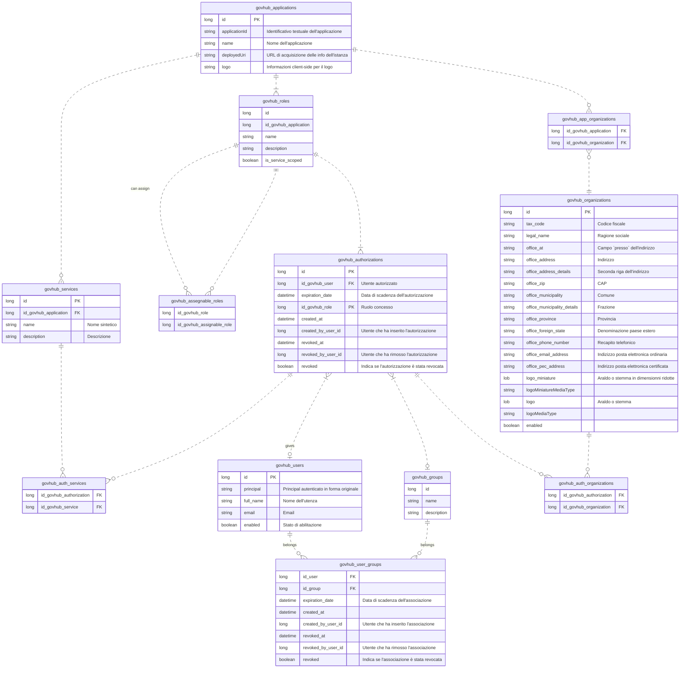

# Schema dati

```mermaid fullWidth="true"
erDiagram

    govhub_applications ||..o{ govhub_services : ""
    govhub_applications ||..|{ govhub_roles : ""
    govhub_applications ||..o{ govhub_app_organizations : ""
    govhub_roles ||..o{ govhub_assegnable_roles : "can assign"   
    govhub_assegnable_roles }o..|| govhub_roles : ""
    govhub_roles ||..|{ govhub_authorizations : ""
    govhub_app_organizations }o..|| govhub_organizations  : ""
    govhub_services ||..o{ govhub_auth_services : ""
    govhub_authorizations ||..o{ govhub_auth_services : ""
    govhub_authorizations }|..o| govhub_groups : ""

    govhub_authorizations }|..o| govhub_users : "gives"
    govhub_authorizations ||..o{ govhub_auth_organizations : ""
    govhub_organizations ||..o{ govhub_auth_organizations : ""
    govhub_users ||..o{ govhub_user_groups  : "belongs"
    govhub_groups ||..o{ govhub_user_groups : "belongs"


    govhub_groups {
        long id
        string name
        string description
    }

    govhub_user_groups {
        long id_user FK
        long id_group FK
        datetime expiration_date "Data di scadenza dell'associazione"
        datetime created_at
        long created_by_user_id "Utente che ha inserito l'associazione"
        datetime revoked_at
        long revoked_by_user_id "Utente che ha rimosso l'associazione"
        boolean revoked "Indica se l'associazione è stata revocata"      }
   
    govhub_users {
        long id PK
        string principal "Principal autenticato in forma originale"
        string full_name "Nome dell'utenza"
        string email "Email"
        boolean enabled "Stato di abilitazione"
    }

    govhub_authorizations {
        long id PK
        long id_govhub_user FK "Utente autorizzato"
        datetime expiration_date "Data di scadenza dell'autorizzazione"
        long id_govhub_role PK "Ruolo concesso"
        datetime created_at
        long created_by_user_id "Utente che ha inserito l'autorizzazione"
        datetime revoked_at
        long revoked_by_user_id "Utente che ha rimosso l'autorizzazione"
        boolean revoked "Indica se l'autorizzazione è stata revocata"        
    }

    govhub_auth_organizations {
        long id_govhub_authorization FK
        long id_govhub_organization FK 
    }

    govhub_auth_services {
        long id_govhub_authorization FK
        long id_govhub_service FK 
    }

    govhub_organizations {
        long id PK 
        string tax_code "Codice fiscale"
        string legal_name "Ragione sociale"
        string office_at "Campo `presso` dell'indirizzo"
        string office_address "Indirizzo"
        string office_address_details "Seconda riga dell'indirizzo"
        string office_zip "CAP"
        string office_municipality "Comune"
        string office_municipality_details "Frazione"
        string office_province "Provincia"
        string office_foreign_state "Denominazione paese estero"
        string office_phone_number "Recapito telefonico"
        string office_email_address "Indizizzo posta elettronica ordinaria"
        string office_pec_address "Indirizzo posta elettronica certificata"
        lob logo_miniature "Araldo o stemma in dimensionni ridotte"
        string logoMiniatureMediaType ""
        lob logo "Araldo o stemma"
        string logoMediaType ""
        boolean enabled 
    }

    govhub_services {
        long id PK 
        long id_govhub_application FK
        string name "Nome sintetico"
        string description "Descrizione"
    }

    govhub_app_organizations {
        long id_govhub_application FK
        long id_govhub_organization FK 
    }

    govhub_applications {
        long id PK
        string applicationId "Identificativo testuale dell'applicazione"
        string name "Nome dell'applicazione"
        string deployedUri "URL di acquisizione delle info dell'istanza"
        string logo "Informazioni client-side per il logo"
    }

    govhub_roles {
        long id
        long id_govhub_application
        string name
        string description
        boolean is_service_scoped
    }

    govhub_assegnable_roles {
        long id_govhub_role
        long id_govhub_assignable_role
    }


```
